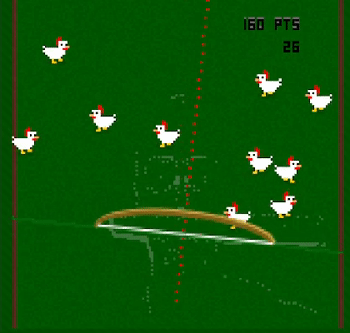

# K1n3kt Archery

K1n3kt Archery is a < 13kb JavaScript game for the js13k 2023 competition.

The game is an archery simulator, following the theme "13th century".

This year I was venturesome and built a game that uses computer vision techniques, which the player controls through the camera.

The game works by detecting the angle to the main straight line in the image, using the [Hough Transform](https://en.wikipedia.org/wiki/Hough_transform) that I implemented from scratch in JavaScript.

The biggest challenge is dealing with image noise and lighting. I hope players have patience!

Play the game!: [https://arturaugusto.github.io/k1n3kt-archery/](https://arturaugusto.github.io/k1n3kt-archery/)